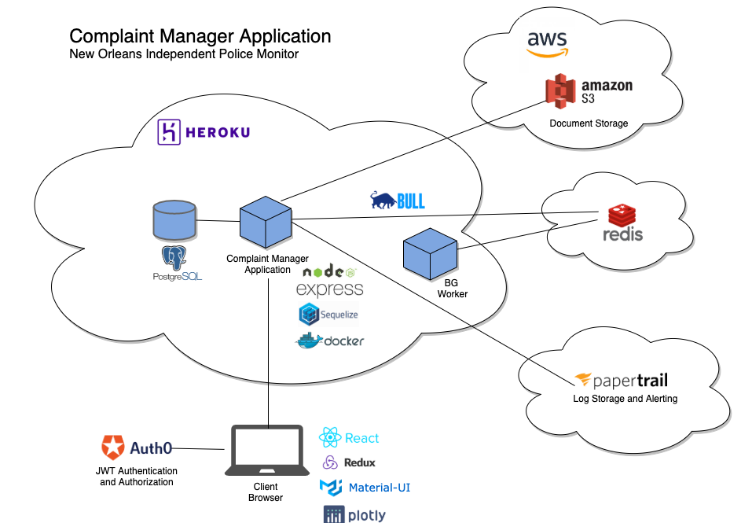
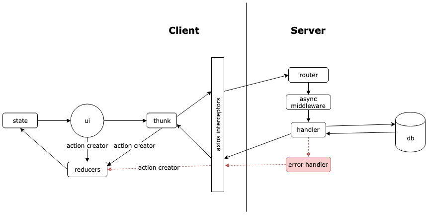

# Development Resources
## Architecture diagram

## React-Redux Data Flow Diagram

## API Documentation
### Postman
[Postman](https://www.postman.com/postman/) is a REST client, API runner, and documentation tool. We use it to test out our API endpoints without the overhead of the frontend. You can explore some of the documented endpoints [here](). 

## Testing
